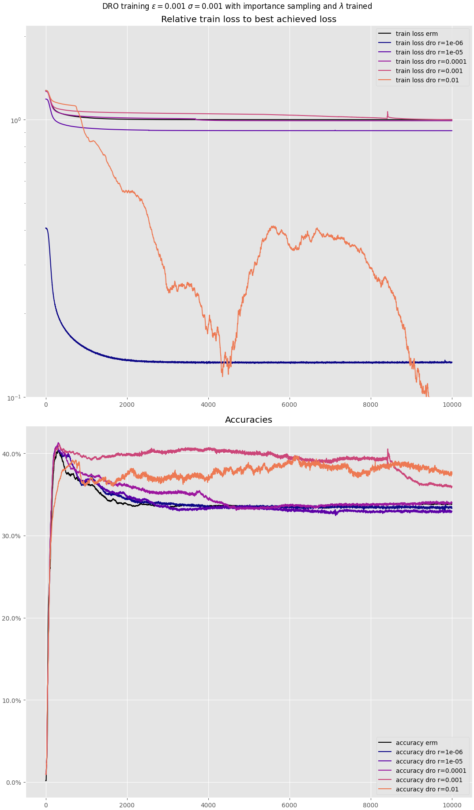
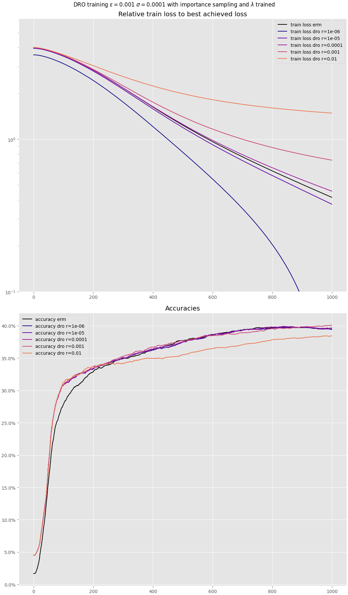

=========================
Illustration on iWildsCam
=========================

The library can be applied to a wide range of difficult problems in machine
learning.

.. and since it has been mostly showcased on more simple cases (either
.. linear problems or low dimensional ones),

This short page aims at
illustrating the use of ``SkWDRO`` to robustify the performances of a Neural
Network on a real dataset: iWildsCam.

.. describing
.. some results related to a more realistic example of difficult model.

The dataset
===========

The `iWildsCam dataset <https://wilds.stanford.edu/>`_\ [KSMX21]_ is composed of images
of animals from various places on earth. They are labeled with their specie
title among 60 possible labels, as well as a location on earth.
The dataset is then split in such a way that the training/validation set contains
images from a fixed set of locations, and the test set contains
images from other locations, absent from the training set.

This split of the dataset is an example of a
**distribution shift**. Indeed the testing set contains visual
features that are absent of the training set for a given animal, and hence cannot
be seen by the machine learning model used. So this model must accomodate for this shift
during its training in order to obtain good test results.

Methodology
===========

The data receives a pre-treatement as described in [#MRPH24]_, using their trained
neural network to provide a fix set of pretrained features that must be classified.
As described in their paper, those pretrained features come from a Resnet50 network
pretrained on Imagenet.

.. , reusing their rich intermediate representations at late
.. layers.

Both a multiclass logistic regression classifier and a shallow (two-layers)
neural network are tested.
They are fit for a regularized Wasserstein ambiguity set of type :math:`W_2`,
measured as the WDRO dual objective described in `this tutorial <why_skwdro>`__, for
the Euclidean metric squared as ground cost, without allowing label switches.
The dual variable :math:`\lambda` is optimized together with the parameters of the
neural network, with the ``Adam`` optimisation algorithm, and we discuss its impact
on the procedure below.
The ambiguity set's radius :math:`\rho` is set to a range of pre-defined values
:math:`10^{\{-6\dots -2\}},0` that we compare by linking it to the color codes of the
curves below.
The ERM optimisation procedure is shown as reference in black.
We report those results below, showing how the optimisation procedure manages to
achieve good accuracies in multiple hyperparameters setting.

Results
=======

We show the results obtained from run scripts one may find in our supplementary
`experiments repository <https://github.com/floffy-f/skwdro-experiments>`_,
running the following command:

.. code-block:: console
   :caption: Launch this command in your terminal to run the Wilds experiments

   $ # Optional: relaunch the experiments
   $ # uv run optim_script.v2.py -s 0.001 -is on -l -m train
   $ # Plot results
   $ uv run optim_script.v2.py -s 0.001 -is on -l -m plot_acc

.. warning:: As a disclaimer: this part of the code is not per se part of the
   ``SkWDRO`` library, hence it does not abide to its quality standards. It is
   meant as a research script to investigate this specific dataset, and did not
   receive the same care as the library itself.

You may of course play with the hyperparameters available. By default, the
options let you train a shallow network with one hidden layer (of 64 neurons).
You can change the training hyperparameters, but you will need to dive into the
code to change more subtle settings like the architecture. Still, a linear model
(with the ``-c`` flag) is available.

Please refer to the output of the help section to get more details:

.. code-block:: console
   :caption: Help section

   $ uv run optim_script.v2.py --help

The neural net example
----------------------

The training outcomes for the neural network is as follows:

Notice how the overfitting behaviour changes substantially with the robustness radius :math:`\rho`.

* For small values of :math:`\rho`, the accuracy raises in the first hundred iterations,
  and then goes down as the training procedure overfits the training set.
* In contrast, for higher values of :math:`\rho`, the accuracy raises steadily. The training
  loss is higher, displaying its more pessimistic nature.

.. As a followup on

As a side-result,
one may study the results of the :math:`\lambda` optimisation depending on the
chosen radius, and how much it changes. This way we may deduce how much importance
we give to its optimisation (recall the
`experiments on lambda optimisation landscape <examples/Study/plot_lambda_landscape.html>`__).

.. code-block:: console
   :caption: See how much lambda varies depending on the problem studied.

   $ uv run optim_script.v2.py -s 0.001 -is on -l -m tb_lam
   Rho      | Lmin  | Lmax  | ratio
   -       -       -       -
   ρ=1.0e-06        | 109672        | 109752 | 1.00
   ρ=1.0e-05        | 10975         | 11054 | 1.01
   ρ=1.0e-04        | 1098  | 1180 | 1.08
   ρ=1.0e-03        | 110   | 188 | 1.71
   ρ=1.0e-02        | 11    | 102 | 9.32
   -       -       -       -

A linear separator
------------------

Then one may try a linear model yielding vastly different results, and prompting
other interpretation as of the linear separability of the frozen features:

.. code-block:: console
   :caption: Here is a slightly different setting for the linear case

   $ # uv run optim_script.v2.py -s 0.0001 -is on -l -c -m train
   $ uv run optim_script.v2.py -s 0.0001 -is on -l -c -m plot_acc_train

.. _.. note::
.. The plot above illustrate the training of the linear model on a smaller number of iterations.
.. On 10000 iterations, we would observe the same overfitting behaviour as above in the long run.
.. We zoom on the first iterations to show the difference between radii that yield monotonous
.. accuracy increases and others that start to decrease after 800 iterations.

The behaviour of the optimisation procedure provides some clues on how to find a suitable radius
:math:`\rho`: we want it to yield a fast and stable optimisation procedure (unlike
:math:`\rho=10^{-2}` above), but still avoiding overfitting (unlike :math:`\rho\le 10^{-4}`
above). So here a radius around ``1e-3`` seems fitting.

References
==========

.. [#MRPH24] Mehta, Roulet, Pillutla, and Harchaoui: **Distributionally Robust Optimization with Bias and Variance Reduction**, *ICLR*, 2024
.. [#KSMX21] Koh, Sagawa, Marklund, Xie, Zhang, Balsubramani, Hu, Yasunaga, Phillips, Gao, Lee, David, Stavness, Guo, Berton, Haque, Beery, Leskovec, Kundaje, Pierson, Levine, Finn, and Liang: **Wilds: A benchmark of in-the-wild distribution shifts. In International Conference on Machine Learning**, *ICML*, 2021
